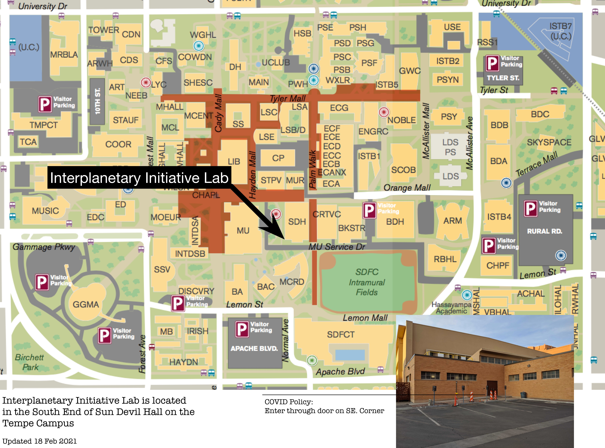

# This document contains a lot of the more technical information pertaining to the Interplanetary Initiative Lab.
*Note that this document will be more update to date than any of the information on the Interplanetary Initative Lab Website*

# Location of the Lab
Given that the lab's main entrance is currently connected to the COVID testing center's exit, our entrance has been shifted to the south side of the Sun Devil Hall. See the map below.
.
<a/>
As of now that entrance will be locked, so please message someone on slack or email *iilab@asu.edu* to get the door opened.

# II-Lifeguard Calendar
Given that volunteers/members can only access the lab when a II-Lifeguard is present, the below calendar is useful for estimating when you can enter the lab. *Note that this calendar is just an estimate, so take it with a grain of salt and either email or slack the person who is listed as present in the lab*
[Google Calendar](https://calendar.google.com/calendar/u/2?cid=Y19zcWNpdXFhb2RxM3Q1aGU1MHIxNzc3Zm9wa0Bncm91cC5jYWxlbmRhci5nb29nbGUuY29t)

# 3D Printer Operation
When operating the makerbot replicator printer, use the following github repo to export valid g-code (or use makerbot's slicing software).
[gcode-gen](https://github.com/rpavlik/Rep2x-GCodeSnippets-PrusaSlicer)
